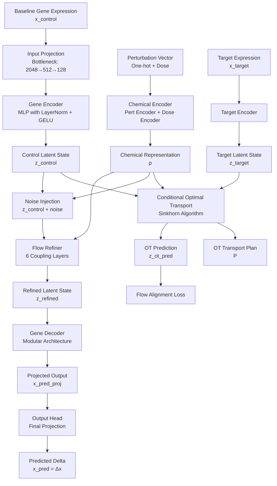

# Conditional Optimal Transport with Flow Refinement for Drug Perturbation Prediction

## Model Architecture Overview

The CondOT-GRN (Conditional Optimal Transport - Gene Regulatory Network) model is a deep learning framework designed to predict post-perturbation gene expression profiles from baseline cellular states under drug treatment. The architecture integrates optimal transport theory with normalizing flows to model the complex transformation from control to perturbed cellular states.



## Core Design Principles

1. **Delta Prediction Paradigm**: The model predicts the differential expression (delta) rather than absolute expression, enabling better generalization across cell types and experimental conditions.

2. **Optimal Transport Guidance**: Uses conditional optimal transport to learn the optimal mapping between control and perturbed latent spaces, providing geometric constraints on the transformation.

3. **Flow-Based Refinement**: Normalizing flows refine the OT prediction by learning complex, conditional transformations that respect biological constraints.

4. **Modular Decoder Design**: The decoder employs a modular architecture with multiple specialized heads to capture gene expression patterns across different functional modules.

## Detailed Component Analysis

### 1. Input Processing Layer

#### 1.1 Input Projection (Bottleneck Architecture)
- **Purpose**: Projects high-dimensional gene expression data (typically 10,000-20,000 genes) to a manageable internal working dimension
- **Architecture**: 
  - Three-stage bottleneck: `input_dim → 2048 → 512 → model_in_dim (128)`
  - Each stage includes: Linear → LayerNorm → GELU → Dropout(0.1)
  - Enables efficient processing while preserving essential biological information
- **Rationale**: Reduces computational complexity while maintaining model capacity through the bottleneck structure

#### 1.2 Data Preprocessing Pipeline
- **Log Transformation**: Automatic detection and application of log1p if not already applied
- **Standardization**: StandardScaler normalization with automatic detection of pre-standardized data
- **Clipping and Scaling**: Values clipped to [-10, 10] range, then scaled by 10 to [-1, 1]
- **Gene Alignment**: Ensures consistent gene ordering between training and test sets using common gene intersection

### 2. Gene Encoder

#### 2.1 Architecture
- **Input Dimension**: `model_in_dim` (default: 128)
- **Output Dimension**: `latent_dim` (default: 64-256, hyperparameter)
- **Hidden Dimension**: `hidden_dim` (default: 256-1024, hyperparameter)
- **Structure**:
  ```
  Input Projection: Linear(input_dim → hidden_dim)
  MLP Blocks: n_layers × [Linear → LayerNorm → GELU → Dropout]
  Output Projection: Linear(hidden_dim → hidden_dim//2) → LayerNorm → GELU → Dropout → Linear(hidden_dim//2 → latent_dim)
  ```

#### 2.2 Design Features
- **Layer Normalization**: Applied after each linear layer for stable training
- **GELU Activation**: Gaussian Error Linear Unit provides smooth gradients
- **Dropout Regularization**: Default 0.1 dropout rate to prevent overfitting
- **Purpose**: Encodes baseline cellular state into a low-dimensional latent representation that captures essential biological features

### 3. Chemical Encoder

#### 3.1 Perturbation Encoder
- **Input**: One-hot encoded perturbation vector (pert_dim dimensions)
- **Architecture**: 
  - Linear(pert_dim → hidden_dim) → LayerNorm → GELU → Dropout
  - Linear(hidden_dim → hidden_dim//2) → LayerNorm → GELU → Dropout
- **Output**: Perturbation feature vector of dimension `hidden_dim//2`

#### 3.2 Dose Encoder
- **Input**: Normalized dose value (scaled to [0, 1])
- **Architecture**: 
  - Linear(1 → 32) → GELU → Linear(32 → 32) → GELU
- **Output**: Dose feature vector of dimension 32
- **Rationale**: Captures dose-response relationships through non-linear transformations

#### 3.3 Fusion Layer
- **Input**: Concatenated perturbation and dose features [pert_feat, dose_feat]
- **Architecture**: 
  - Linear(hidden_dim//2 + 32 → chem_dim) → LayerNorm → GELU → Dropout
- **Output**: Chemical representation `p` of dimension `chem_dim` (default: 32-128)
- **Purpose**: Creates a unified representation of the chemical perturbation that conditions all downstream transformations

### 4. Conditional Optimal Transport Module

#### 4.1 Optimal Transport Formulation
- **Source Distribution**: Control latent states `z_control` (batch_size × latent_dim)
- **Target Distribution**: Perturbed latent states `z_target` (batch_size × latent_dim)
- **Cost Matrix**: Squared Euclidean distance `C[i,j] = ||z_control[i] - z_target[j]||²`
- **Marginal Constraints**: Uniform marginals `a = b = 1/batch_size`

#### 4.2 Sinkhorn Algorithm
- **Entropic Regularization**: Parameter `eps` (default: 0.05-0.2) controls transport plan smoothness
- **Iterations**: `max_iter` (default: 30-100) iterations for convergence
- **Update Rules**:
  ```
  u = eps * (log(a) - logsumexp((u + v - C) / eps, dim=1))
  v = eps * (log(b) - logsumexp((u + v - C) / eps, dim=0))
  ```
- **Transport Plan**: `P = exp((u + v - C) / eps)`
- **OT Prediction**: `z_ot_pred = P @ z_target`

#### 4.3 Biological Interpretation
- **Geometric Constraint**: OT ensures the transformation respects the geometric structure of the latent space
- **Mass Preservation**: Maintains the distributional properties of cellular states during transformation
- **Conditional Guidance**: The chemical representation `p` influences the transport through the flow refiner

### 5. Flow Refiner (Normalizing Flows)

#### 5.1 Architecture
- **Number of Layers**: `flow_layers` (default: 4-8, typically 6)
- **Coupling Layer Design**: Alternating mask patterns (mask_type = 0 or 1)
- **Conditioning**: Each layer is conditioned on chemical representation `p`

#### 5.2 Coupling Layer Mechanism
- **Mask Pattern**: Alternating masks split latent dimensions into two halves
  - Mask type 0: Even indices masked, odd indices transformed
  - Mask type 1: Odd indices masked, even indices transformed
- **Scale Network**: 
  - Input: [z1, p] where z1 is the unmasked half
  - Architecture: Linear → GELU → Linear → Tanh
  - Output: Scale factor for affine transformation
- **Translate Network**:
  - Input: [z1, p]
  - Architecture: Linear → GELU → Linear
  - Output: Translation factor for affine transformation
- **Transformation**: `z2_new = z2 * exp(scale) + translate`
- **Log Determinant**: `log_det_jac = sum(scale)` for each layer

#### 5.3 Flow Refinement Process
1. **Noise Injection**: `z_refined = z_control + noise` where `noise = randn * ||p|| * 0.1`
2. **Sequential Coupling**: Apply coupling layers sequentially with accumulated log determinant
3. **Output**: Refined latent state `z_refined` that aligns with OT prediction

#### 5.4 Biological Motivation
- **Complex Transformations**: Flows can model highly non-linear, conditional transformations
- **Invertibility**: Preserves information content through invertible transformations
- **Conditional Dependence**: Each transformation is explicitly conditioned on the chemical perturbation

### 6. Gene Decoder

#### 6.1 Modular Architecture
- **Main Decoder**: 
  - Linear(latent_dim → hidden_dim) → LayerNorm → GELU → Dropout
  - Linear(hidden_dim → hidden_dim) → LayerNorm → GELU → Dropout
- **Module Heads**: `n_modules` (default: 10) parallel heads
  - Each head: Linear(hidden_dim → hidden_dim//2) → LayerNorm → GELU → Dropout → Linear(hidden_dim//2 → module_size)
  - Module size: `output_dim // n_modules` (handles remainder in last module)
- **Global Residual**: Linear(latent_dim → output_dim) provides global context
- **Final Output**: `output = module_pred + 0.1 * global_pred`

#### 6.2 Design Rationale
- **Specialization**: Each module head can specialize in different gene functional groups
- **Parallelism**: Enables efficient parallel computation across modules
- **Residual Connection**: Global residual ensures all genes receive direct information from latent state
- **Output Dimension**: Projects to `model_in_dim` (128) for internal representation

### 7. Output Head

#### 7.1 Final Projection
- **Architecture**: 
  - Linear(model_in_dim → hidden_dim) → LayerNorm → GELU → Dropout
  - Linear(hidden_dim → output_dim)
- **Purpose**: Projects from internal dimension back to full gene space
- **Output**: Predicted differential expression `x_pred = Δx`

#### 7.2 Delta Prediction
- **Target**: Model predicts `x_target - x_baseline` rather than absolute `x_target`
- **Advantages**:
  - Better generalization across cell types
  - Focuses on perturbation-specific changes
  - Reduces baseline-dependent biases
- **Reconstruction**: Final prediction obtained as `x_pred_abs = x_baseline + x_pred`

## Loss Function Design

### 1. Multi-Component Loss Architecture

The training objective combines multiple loss terms to ensure accurate prediction while maintaining geometric and biological constraints:

```
L_total = α·L_recon + β·L_ot + γ·L_flow + η·L_de + λ_grn·L_grn + λ_reg·L_reg
```

### 2. Reconstruction Loss (L_recon)

#### 2.1 Formulation
- **Type**: Mean Squared Error (MSE)
- **Definition**: `L_recon = MSE(x_pred, x_target_delta)`
- **Components**:
  - `x_pred`: Model prediction of differential expression
  - `x_target_delta = x_target - x_baseline`: Ground truth differential expression
- **Weight**: `α` (default: 0.5-2.0, typically 1.0)
- **Purpose**: Primary objective ensuring accurate gene expression prediction

#### 2.2 Characteristics
- **Scale**: Operates in normalized gene expression space (values in [-1, 1])
- **Gradient Flow**: Direct supervision signal for the entire decoder pathway
- **Biological Relevance**: Captures both magnitude and direction of expression changes

### 3. Optimal Transport Loss (L_ot)

#### 3.1 Formulation
- **Type**: Transport Cost
- **Definition**: `L_ot = (1/B) · Σ(P[i,j] · C[i,j])`
  - `P`: Transport plan from Sinkhorn algorithm
  - `C`: Cost matrix (squared Euclidean distances)
  - `B`: Batch size
- **Weight**: `β` (default: 0.1-1.0, typically 0.1)
- **Purpose**: Ensures the learned transformation respects optimal transport geometry

#### 3.2 Biological Interpretation
- **Mass Conservation**: Encourages preservation of cellular state distribution properties
- **Geometric Consistency**: Maintains relationships between similar cellular states
- **Regularization Effect**: Prevents arbitrary transformations that violate biological constraints

### 4. Flow Refinement Loss (L_flow)

#### 4.1 Formulation
- **Type**: Alignment Loss + Jacobian Regularization
- **Definition**: 
  ```
  L_flow = MSE(z_refined, z_ot_pred.detach()) + 0.01 · mean(log_det_jac²)
  ```
- **Components**:
  - **Alignment Term**: Ensures flow-refined state aligns with OT prediction
  - **Jacobian Regularization**: Penalizes extreme transformations (prevents numerical instability)
- **Weight**: `γ` (default: 0.05-0.2, typically 0.1)
- **Detached Target**: `z_ot_pred` is detached to prevent double-counting gradients

#### 4.2 Training Dynamics
- **Two-Stage Learning**: 
  1. OT provides geometric guidance (detached)
  2. Flow learns to refine OT prediction with conditional transformations
- **Stability**: Jacobian regularization prevents flow from learning pathological transformations
- **Conditional Learning**: Flow explicitly learns perturbation-dependent refinements

### 5. Differential Expression Loss (L_de)

#### 5.1 Purpose
- **Focus**: Emphasizes accuracy on genes with significant expression changes
- **Weight**: `η` (default: 0.1-1.0, typically 0.5)
- **Note**: Currently implemented in evaluation metrics but not directly in training loss
- **Future Extension**: Can be computed as weighted MSE focusing on top-K differentially expressed genes

#### 5.2 Evaluation Metrics
- **DE Gene Identification**: 
  - Top-K genes by absolute log-fold-change: `|log2((target + ε)/(control + ε))|`
  - K = min(20, n_genes) per perturbation type
- **DE-Specific Metrics**: MSE_DE, PCC_DE, R2_DE computed on identified DE genes

### 6. Gene Regulatory Network Loss (L_grn)

#### 6.1 Current Status
- **Value**: Currently set to 0.0 (not active)
- **Weight**: `λ_grn` (default: 0.01)
- **Future Potential**: Could incorporate:
  - Gene-gene interaction constraints
  - Pathway-level consistency
  - Regulatory network topology preservation

### 7. Regularization Loss (L_reg)

#### 7.1 Formulation
- **Type**: L2 Weight Regularization
- **Definition**: `L_reg = Σ(||θ||²)` for all model parameters θ
- **Weight**: `λ_reg` (default: 1e-5)
- **Purpose**: Prevents overfitting and encourages smooth solutions

### 8. Loss Weight Configuration

#### 8.1 Default Weights
```python
loss_weights = {
    'recon': 1.0,      # α: Primary reconstruction objective
    'ot': 0.1,         # β: Optimal transport guidance
    'flow': 0.1,       # γ: Flow refinement alignment
    'de': 0.5,         # η: Differential expression focus
    'reg': 1e-5        # λ_reg: Weight regularization
}
```

#### 8.2 Hyperparameter Optimization
- **Search Space**: All weights are optimized via Optuna hyperparameter search
- **Ranges**:
  - `α`: [0.5, 2.0]
  - `β`: [0.1, 1.0]
  - `γ`: [0.05, 0.2]
  - `η`: [0.1, 1.0]
- **Adaptive Tuning**: Weights adjusted based on validation performance

### 9. Training Strategy

#### 9.1 Gradient Accumulation
- **Steps**: 4 accumulation steps per optimizer update
- **Effective Batch Size**: `batch_size × 4`
- **Rationale**: Enables training with larger effective batches on limited GPU memory

#### 9.2 Gradient Clipping
- **Method**: Gradient norm clipping
- **Max Norm**: 1.0
- **Purpose**: Prevents gradient explosion, stabilizes training

#### 9.3 Learning Rate Schedule
- **Type**: Cosine Annealing with Warm Restarts
- **Parameters**: 
  - `T_0 = 10`: Initial period length
  - `T_mult = 2`: Period multiplier
  - `eta_min = 1e-6`: Minimum learning rate
- **Effect**: Periodic restarts help escape local minima

## Data Preprocessing and Augmentation

### 1. Gene Expression Preprocessing

#### 1.1 Automatic Preprocessing Detection
- **Log Transformation Check**: 
  - Condition: `max(data) < 20.0 and min(data) >= 0.0`
  - If false, applies `log1p(data)`
- **Standardization Check**:
  - Condition: `|mean(data)| < 0.5 and 0.5 < std(data) < 2.0`
  - If false, applies StandardScaler normalization

#### 1.2 Normalization Pipeline
1. **Non-negative Enforcement**: `data = max(data, 1e-10)`
2. **Log Transformation**: `data = log1p(data)` (if needed)
3. **Standardization**: `data = StandardScaler.fit_transform(data)` (if needed)
4. **Clipping**: `data = clip(data, -10, 10)`
5. **Final Scaling**: `data = data / 10.0` → range [-1, 1]

#### 1.3 Gene Alignment
- **Common Gene Intersection**: Identifies genes present in both training and test sets
- **Index Mapping**: Creates mapping indices for consistent gene ordering
- **Dimensionality**: Model operates on common gene set (typically 10,000-15,000 genes)

### 2. Perturbation Encoding

#### 2.1 One-Hot Encoding
- **Method**: `pd.get_dummies(perturbation_labels)`
- **Standardization**: Ensures consistent encoding across train/test splits
- **Missing Perturbations**: Test perturbations not in training set are zero-padded

#### 2.2 Control Sample Identification
- **Detection Rules**:
  - Exact match: 'control', 'Control', 'ctrl', 'Ctrl'
  - Substring match: 'negctrl' (case-insensitive)
- **Reference Perturbation**: If no control samples, uses first perturbation as reference baseline
- **Critical Requirement**: Training set must contain control samples for proper learning

### 3. Dose Value Processing

#### 3.1 Normalization
- **Method**: Min-max normalization to [0, 1]
- **Formula**: `dose_norm = (dose - min(dose)) / (max(dose) - min(dose))`
- **Constant Dose**: If all doses are equal, sets to zero vector
- **Missing Values**: Filled with 0.0

### 4. Data Augmentation (Training Only)

#### 4.1 Noise Injection
- **Type**: Gaussian noise
- **Magnitude**: `noise ~ N(0, 0.05²)`
- **Application**: `x_baseline = x_baseline + noise`

#### 4.2 Random Masking
- **Probability**: 5% of features randomly masked (set to zero)
- **Purpose**: Encourages robustness to missing or noisy features
- **Effect**: Prevents overfitting to specific gene expression patterns

### 5. Training Data Pairing Strategy

#### 5.1 Control-to-Perturbed Pairs
- **Control Samples**: 
  - Baseline: Current control sample
  - Target: Randomly selected perturbed sample from any perturbation type
- **Perturbed Samples**:
  - Baseline: Randomly selected control sample
  - Target: Current perturbed sample

#### 5.2 Test Data Pairing
- **Fixed Pairs**: Deterministic pairing for reproducibility
- **Control Samples**: Paired with perturbed samples in round-robin fashion
- **Perturbed Samples**: Paired with control samples deterministically

## Training Process and Hyperparameter Optimization

### 1. Hyperparameter Search Space

#### 1.1 Architecture Hyperparameters
- **latent_dim**: [64, 128, 256] - Latent representation dimensionality
- **chem_dim**: [32, 64, 128] - Chemical representation dimensionality
- **hidden_dim**: [256, 512, 768, 1024] - Hidden layer dimensions (must be divisible by n_heads)
- **n_layers**: [2, 3, 4] - Number of MLP layers in encoder
- **n_heads**: [4, 8, 16] - Number of attention heads (currently unused, reserved for future)
- **dropout**: [0.1, 0.3] - Dropout rate
- **flow_layers**: [4, 5, 6, 7, 8] - Number of coupling layers in flow refiner

#### 1.2 Optimal Transport Hyperparameters
- **ot_eps**: [0.05, 0.2] - Entropic regularization strength
- **ot_max_iter**: [30, 100] - Sinkhorn algorithm iterations

#### 1.3 Training Hyperparameters
- **learning_rate**: [1e-4, 1e-3] (log scale) - Initial learning rate
- **weight_decay**: [1e-5, 1e-4] (log scale) - L2 regularization strength
- **batch_size**: [32, 64, 128, 256] - Batch size per GPU

#### 1.4 Loss Weight Hyperparameters
- **alpha** (recon): [0.5, 2.0] - Reconstruction loss weight
- **beta** (ot): [0.1, 1.0] - Optimal transport loss weight
- **gamma** (flow): [0.05, 0.2] - Flow refinement loss weight
- **eta** (de): [0.1, 1.0] - Differential expression loss weight

### 2. Optimization Strategy

#### 2.1 Optuna Framework
- **Sampler**: TPE (Tree-structured Parzen Estimator) with seed=42
- **Pruner**: MedianPruner
  - `n_startup_trials = 5`: Minimum trials before pruning
  - `n_warmup_steps = 10`: Minimum epochs before pruning
  - `interval_steps = 1`: Pruning check frequency
- **Trials**: 50 hyperparameter optimization trials
- **Direction**: Minimize validation loss

#### 2.2 Training Configuration
- **Max Epochs**: 100 (hyperparameter search), 200 (final training)
- **Early Stopping**: 
  - Patience: 15 epochs (hyperparameter search), 20 epochs (final training)
  - Metric: Validation loss
- **Train/Val Split**: 80/20 random split of training data

### 3. Model Evaluation Metrics

#### 3.1 Global Metrics
- **MSE**: Mean Squared Error across all genes and samples
- **PCC**: Pearson Correlation Coefficient (global)
- **R²**: Coefficient of Determination (global)

#### 3.2 Differential Expression Metrics
- **DE Gene Identification**: 
  - Per-perturbation: Top-K genes by absolute log-fold-change
  - K = min(20, n_genes)
  - Comparison: Perturbed mean vs. control mean
- **MSE_DE**: MSE computed only on DE genes
- **PCC_DE**: Pearson correlation on DE genes
- **R²_DE**: R² score on DE genes

#### 3.3 Metric Computation
- **Gene-wise Centering**: Metrics computed after centering by gene means
- **Robustness**: Handles NaN/Inf values gracefully with fallback to 0.0
- **Aggregation**: DE metrics averaged across all perturbations

### 4. Model Saving and Checkpointing

#### 4.1 Checkpoint Strategy
- **Best Model**: Saved when validation loss improves
- **Final Model**: Saved after training completion with full evaluation results
- **Contents**:
  - Model state dictionary
  - Evaluation metrics
  - Predictions and targets
  - Gene names and indices
  - Preprocessing objects (scaler, PCA if used)
  - Best hyperparameters
  - Model configuration

#### 4.2 Reproducibility
- **Random Seed**: Fixed to 42 for all random operations
- **Deterministic Operations**: CUDA deterministic mode (if applicable)
- **Timestamp**: All saved files include timestamp for versioning

## Applications and Use Cases

### 1. Drug Response Prediction

#### 1.1 Virtual Drug Screening
- **Novel Compounds**: Predict cellular responses to untested chemical compounds
- **Dose Optimization**: Identify optimal dosing strategies for maximum efficacy
- **Toxicity Assessment**: Predict off-target effects and potential toxicities

#### 1.2 Drug Repurposing
- **Mechanism Discovery**: Identify new therapeutic applications for existing drugs
- **Combination Therapy**: Predict synergistic effects of drug combinations
- **Patient Stratification**: Identify patient subgroups likely to respond to specific treatments

### 2. Precision Medicine

#### 2.1 Personalized Treatment
- **Baseline Profiling**: Use patient-specific baseline gene expression
- **Response Prediction**: Forecast individual patient responses to treatments
- **Biomarker Discovery**: Identify predictive biomarkers for treatment selection

#### 2.2 Dose Personalization
- **Optimal Dosing**: Determine patient-specific optimal drug concentrations
- **Adverse Event Prevention**: Predict and avoid toxic dose levels
- **Efficacy Maximization**: Balance efficacy and safety through dose optimization

### 3. Biological Discovery

#### 3.1 Mechanism of Action
- **Pathway Analysis**: Identify affected biological pathways from predicted expression changes
- **Target Identification**: Infer drug targets from expression perturbation patterns
- **Network Inference**: Understand gene regulatory network modifications

#### 3.2 Disease Modeling
- **Disease Progression**: Model how drugs affect disease-associated gene expression
- **Therapeutic Intervention**: Predict effects of interventions on disease states
- **Biomarker Development**: Discover expression signatures associated with treatment outcomes

## Implementation Challenges and Solutions

### 1. Data Challenges

#### 1.1 Sparse and Imbalanced Data
- **Challenge**: Limited samples per perturbation, class imbalance
- **Solution**: 
  - Control-to-perturbed pairing strategy maximizes training signal
  - Data augmentation (noise injection, masking) increases effective dataset size
  - Balanced sampling ensures all perturbation types are represented

#### 1.2 Batch Effects
- **Challenge**: Technical variation between experimental batches
- **Solution**:
  - StandardScaler normalization reduces batch-specific scaling
  - Common gene alignment ensures consistent feature space
  - Model learns robust features through regularization

#### 1.3 Missing Control Samples
- **Challenge**: Some datasets lack explicit control samples
- **Solution**:
  - Reference perturbation mechanism allows using first perturbation as baseline
  - Automatic control detection with multiple naming conventions
  - Clear error messages guide users to provide proper control data

### 2. Computational Efficiency

#### 2.1 High-Dimensional Input
- **Challenge**: Processing 10,000+ genes is computationally expensive
- **Solution**:
  - Bottleneck architecture reduces internal dimensionality
  - Input projection to 128 dimensions maintains efficiency
  - Gradient accumulation enables larger effective batch sizes

#### 2.2 Optimal Transport Computation
- **Challenge**: Sinkhorn algorithm can be slow for large batches
- **Solution**:
  - Configurable iteration count (30-100) balances accuracy and speed
  - Entropic regularization (eps) controls convergence rate
  - Detached gradients prevent unnecessary computation

#### 2.3 Memory Constraints
- **Challenge**: Large models and datasets exceed GPU memory
- **Solution**:
  - Gradient accumulation (4 steps) enables large effective batches
  - Modular decoder architecture allows parallel computation
  - Efficient data loading with pin_memory and multiple workers

### 3. Model Training Stability

#### 3.1 Gradient Explosion
- **Challenge**: Unstable gradients in deep architectures
- **Solution**:
  - Gradient clipping (max_norm=1.0) prevents explosion
  - Layer normalization stabilizes activations
  - Learning rate scheduling with warm restarts

#### 3.2 Overfitting
- **Challenge**: Model memorizes training data
- **Solution**:
  - Dropout regularization (0.1-0.3) at multiple layers
  - L2 weight regularization (1e-5)
  - Early stopping based on validation loss
  - Data augmentation increases effective dataset diversity

#### 3.3 Loss Balancing
- **Challenge**: Multiple loss components with different scales
- **Solution**:
  - Hyperparameter optimization finds optimal loss weights
  - Detached targets prevent gradient interference
  - Adaptive weight tuning based on validation performance

### 4. Generalization Challenges

#### 4.1 Unseen Perturbations
- **Challenge**: Predicting responses to perturbations not in training data
- **Solution**:
  - Chemical encoder learns generalizable perturbation representations
  - Optimal transport provides geometric structure for interpolation
  - Flow refiner enables extrapolation to novel perturbations

#### 4.2 Cross-Cell-Type Transfer
- **Challenge**: Generalizing across different cell types
- **Solution**:
  - Delta prediction paradigm focuses on perturbation effects
  - Latent space captures cell-type-agnostic biological processes
  - Standardized preprocessing ensures consistent feature spaces

#### 4.3 Dose Extrapolation
- **Challenge**: Predicting responses at doses outside training range
- **Solution**:
  - Normalized dose encoding enables interpolation
  - Non-linear dose encoder captures dose-response relationships
  - Flow refiner can extrapolate to novel dose levels

## Model Limitations and Future Directions

### 1. Current Limitations

#### 1.1 Static Predictions
- **Limitation**: Model predicts single timepoint, not temporal dynamics
- **Future**: Extend to time-series prediction with recurrent or transformer architectures

#### 1.2 Single-Cell Aggregation
- **Limitation**: Operates on aggregated or pseudo-bulk data
- **Future**: Incorporate single-cell resolution with attention mechanisms

#### 1.3 Chemical Structure
- **Limitation**: Uses one-hot encoding, ignores molecular structure
- **Future**: Integrate graph neural networks for SMILES/chemical graph encoding

#### 1.4 Gene Regulatory Network
- **Limitation**: GRN loss currently inactive
- **Future**: Incorporate explicit GRN constraints and pathway information

### 2. Potential Extensions

#### 2.1 Multi-Modal Integration
- **Proteomics**: Incorporate protein expression data
- **Metabolomics**: Include metabolic profiles
- **Epigenomics**: Add chromatin accessibility information

#### 2.2 Interpretability
- **Attention Visualization**: Identify which genes/features drive predictions
- **Pathway Enrichment**: Map predictions to biological pathways
- **Mechanism Inference**: Extract interpretable mechanisms from latent representations

#### 2.3 Uncertainty Quantification
- **Bayesian Extensions**: Provide prediction confidence intervals
- **Ensemble Methods**: Combine multiple models for robust predictions
- **Calibration**: Ensure predicted probabilities match empirical frequencies

## Summary

The CondOT-GRN model represents a sophisticated approach to drug perturbation prediction that combines:

1. **Optimal Transport Theory**: Provides geometric constraints for biologically plausible transformations
2. **Normalizing Flows**: Enables complex, conditional transformations while maintaining invertibility
3. **Modular Architecture**: Specialized components for different aspects of the prediction task
4. **Delta Prediction**: Focuses on perturbation-specific changes for better generalization
5. **Comprehensive Loss Design**: Multiple objectives ensure both accuracy and biological consistency

The model's design emphasizes robustness, generalizability, and biological interpretability, making it suitable for both research and clinical applications in drug discovery and precision medicine.

